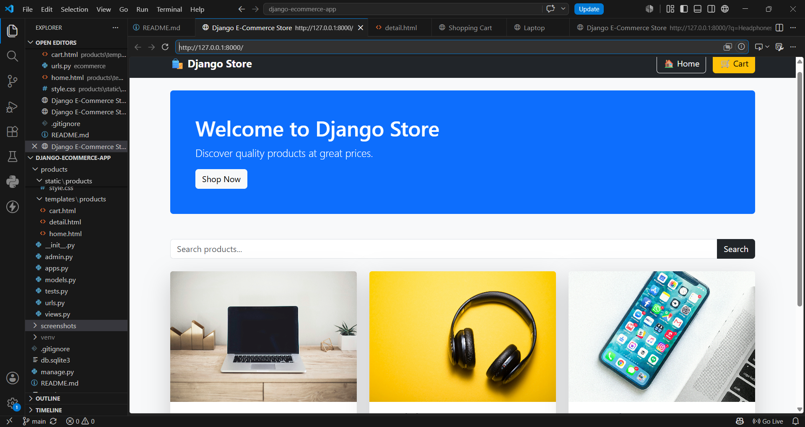
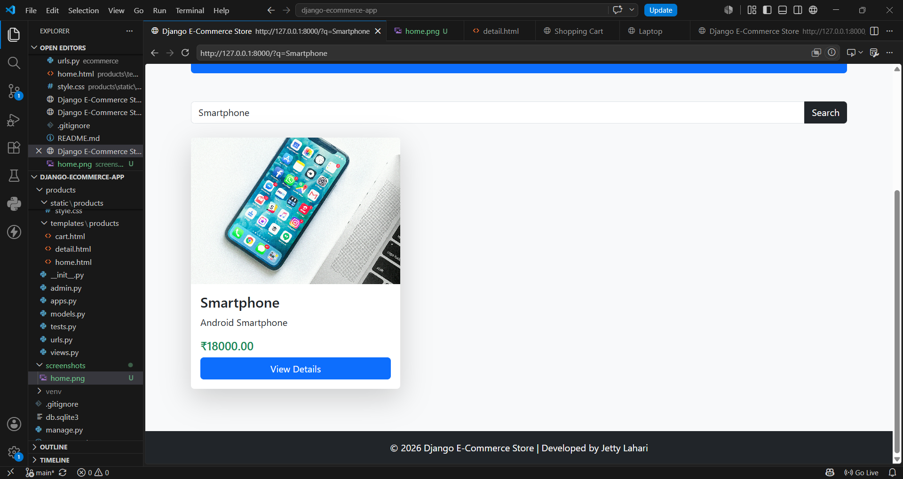
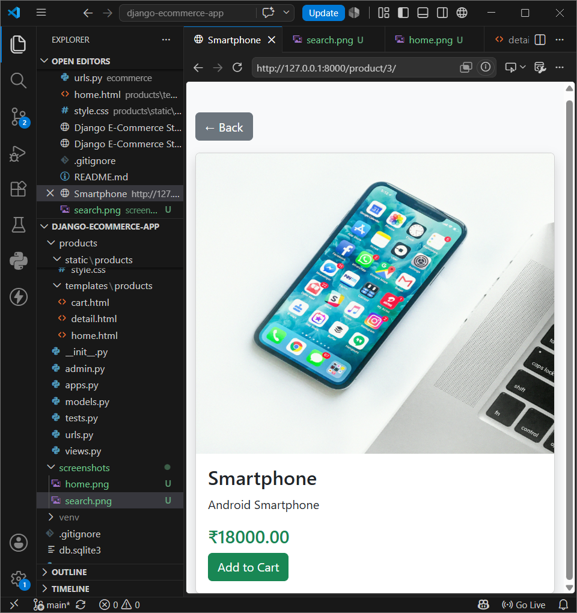
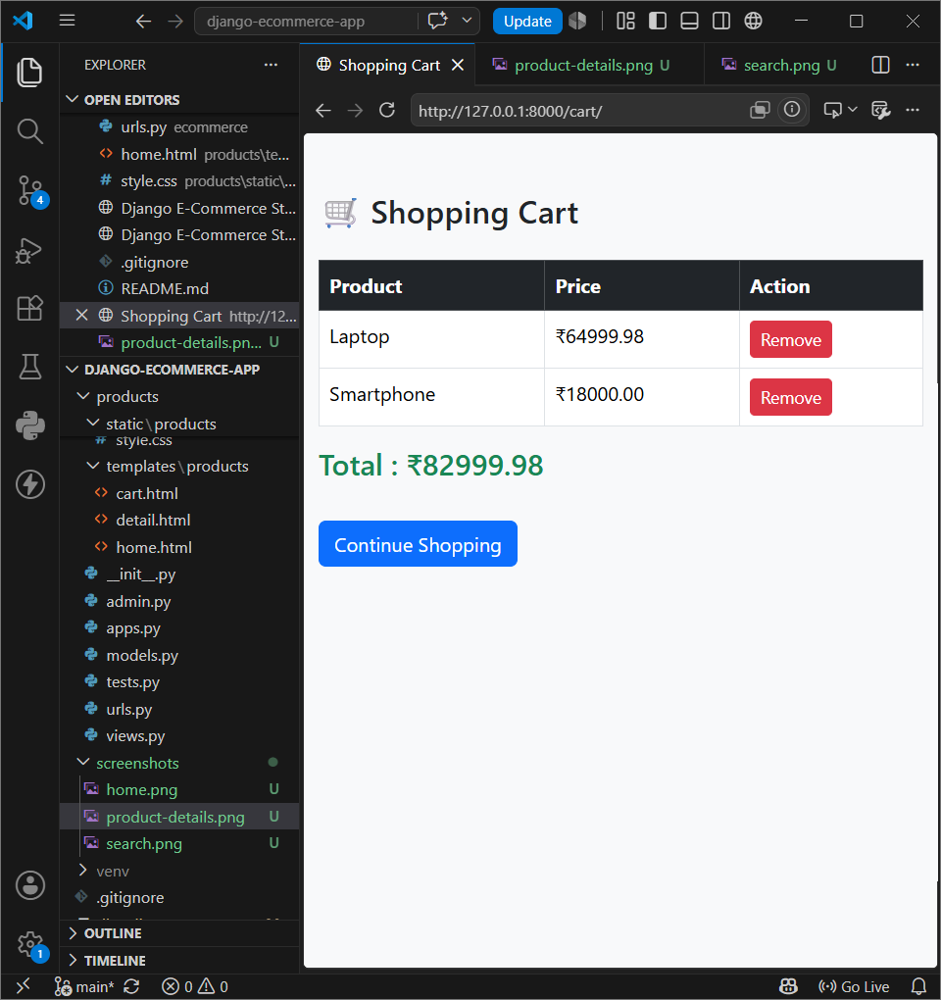
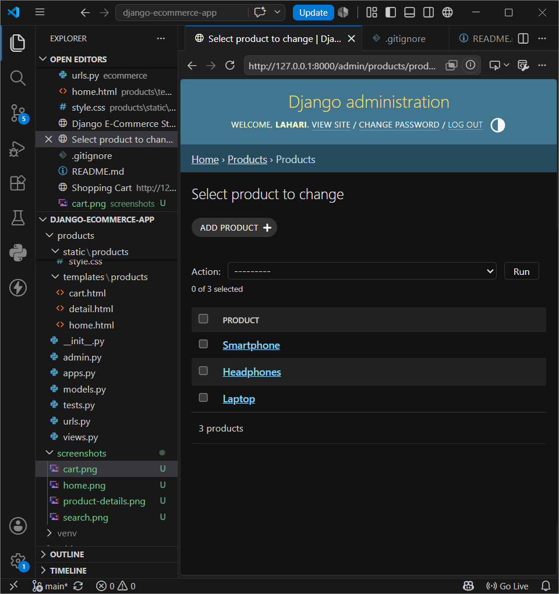

# 🛒 Django E-Commerce Application

A full-stack e-commerce web application built using **Django**, **Python**, **Bootstrap**, and **SQLite**. This project demonstrates core e-commerce functionality including product management, search, product details, and a shopping cart.

---

## 🚀 Features

- 🛍️ Product Listing
- 🔍 Product Search
- 📄 Product Details Page
- 🛒 Shopping Cart
- ❌ Remove from Cart
- 👨‍💼 Django Admin Panel
- 📱 Responsive User Interface
- 🎨 Bootstrap 5 Design
- ⚡ Custom CSS Animations

---

## 🛠️ Tech Stack

- Python
- Django
- HTML5
- CSS3
- Bootstrap 5
- SQLite
- Git
- GitHub

---

## 📂 Project Structure

```
django-ecommerce-app/
│
├── ecommerce/
├── products/
│   ├── templates/
│   ├── static/
│   ├── models.py
│   ├── views.py
│   └── urls.py
│
├── manage.py
├── db.sqlite3
├── requirements.txt
└── README.md
```

---

## ⚙️ Installation

Clone the repository:

```bash
git clone https://github.com/LahariJetti/django-ecommerce-app.git
```

Go to the project folder:

```bash
cd django-ecommerce-app
```

Create a virtual environment:

```bash
python -m venv venv
```

Activate the virtual environment:

### Windows

```bash
venv\Scripts\activate
```

Install dependencies:

```bash
pip install -r requirements.txt
```

Run database migrations:

```bash
python manage.py migrate
```

Start the development server:

```bash
python manage.py runserver
```

Open:

```
http://127.0.0.1:8000/
```

---

## 📸 Screenshots

### 🏠 Home Page



---

### 🔍 Product Search



---

### 📄 Product Details



---

### 🛒 Shopping Cart



---

### 👨‍💼 Django Admin Panel



## 🔮 Future Enhancements

- User Registration
- User Login & Logout
- Product Categories
- Wishlist
- Checkout Page
- Order History
- Online Payment Integration

---

## 👩‍💻 Author

**Jetty Lahari**

GitHub:
https://github.com/LahariJetti